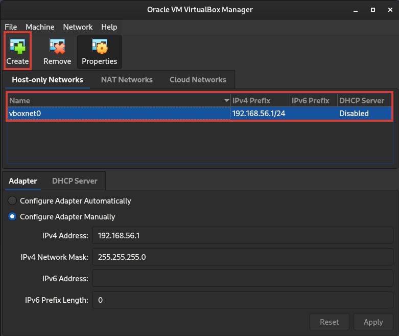
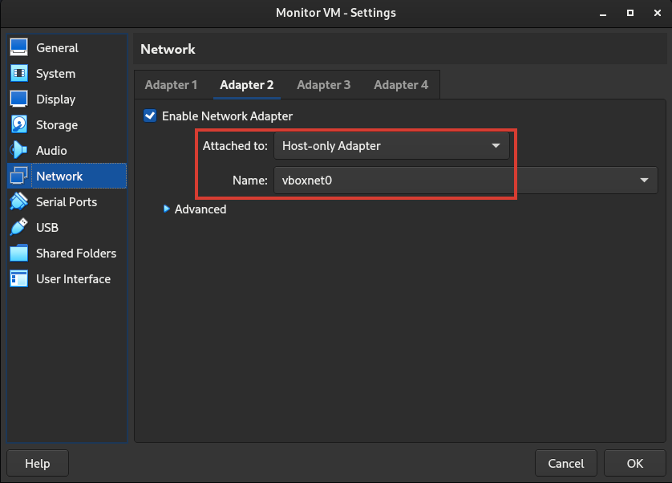
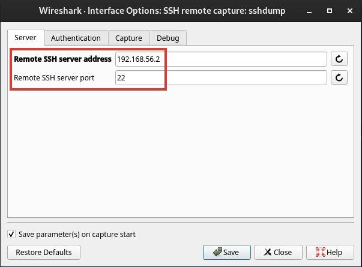
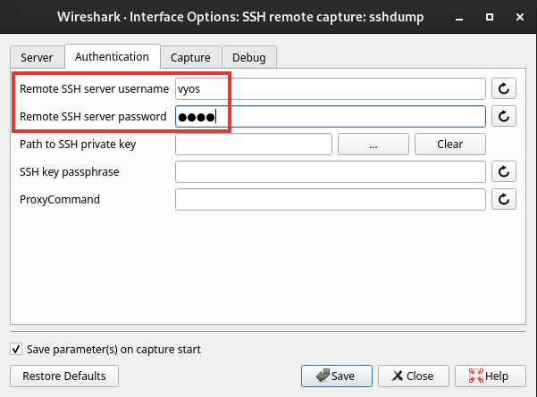
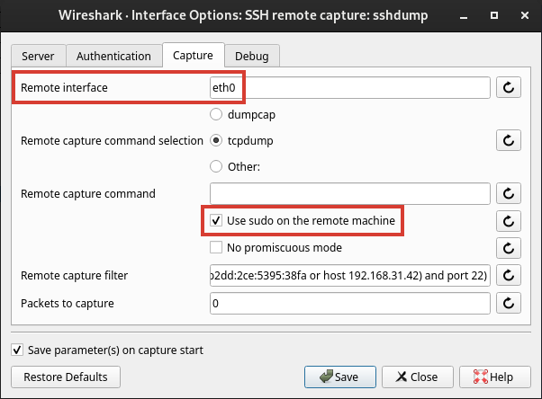

# Einleitung

Zunächst ist es unser Ziel, zwei Router einzurichten. Einen mit VyOS und einen anderen mit Mikrotik RouterOS, welche 
miteinander verbunden sind. Dies kann in VirtualBox durch die Verwendung des Netzwerktyps [Internal Network](https://www.virtualbox.org/manual/ch06.html#network_internal)
erreicht werden.

<figure markdown>
  { loading=lazy width=600px }
</figure>

Außerdem planen wir die Einrichtung einer virtuellen Maschine (VM), welche es ermöglicht, auf das virtuelle Netzwerk
zwischen den beiden Routern zuzugreifen. Diese VM erhält zwar eine Schnittstelle im internen Netzwerk der Router, jedoch
keine IP-Adressen. Durch eine zweite Schnittstelle, die den Netzwerktyp 
[Host-only Adapter](https://www.virtualbox.org/manual/ch06.html#network_hostonly) verwendet, können wir uns
per SSH von unserem PC aus verbinden. Auf diese Weise können wir Wireshark SSH Remote Capture nutzen, um die Pakete auf 
dem Internal Network zu analysieren.

<figure markdown>
  { loading=lazy width=600px }
</figure>

## Router VM's
Erstellen Sie zunächst die virtuellen Maschinen der Router, siehe [1. VyOS](../1_vyos/) und 
[2. Mikrotik RouterOS](../2_routeros/).

## "Monitor VM"
Abschließend richten wir die "Monitor-VM" ein, welche es uns ermöglicht, mit Wireshark auf das interne Netzwerk
zuzugreifen. 

Hierfür navigieren wir zuerst in VirtualBox zum Network Manager (Datei -> Tools -> Network Manager) und
erstellen dort ein neues Host-only Netzwerk:

<figure markdown>
  { loading=lazy }
</figure>

Anschließend erstellen wir eine neue virtuelle Maschine, um ein weiteres VyOS zu installieren. Diesmal fügen wir neben
des "Internal Networks" eine zweite Netzwerkschnittstelle hinzu, welche den Typ "Host-only Adapter" besitzt und das
soeben erstellte Host-only Network `vboxnet0` konfiguriert.

In den erweiterten Einstellungen setzen wir den Promiscuous Mode auf "Allow All". Dadurch verarbeitet die Netzwerkkarte 
der VM alle empfangenen Frames, anstatt nur die Frames, welche an die eigene MAC-Adresse adressiert sind.

<figure markdown>
  { loading=lazy }
</figure>

Danach wird die VyOS Installation durchgeführt (`install image`, analog zum Router). Nachdem die VM neu gestartet wurde,
wird VyOS wie folgt konfiguriert:
```sh
configure
set interfaces eth eth0 ipv6 address no-default-link-local 
set interfaces ethernet eth1 address 192.168.56.2/24
set service ssh 
commit
save
```

## Wireshark für SSH Remote Capture konfigurieren
Um Wireshark zu installieren, besuchen Sie die offizielle Website [wireshark.org](https://www.wireshark.org/), laden Sie
die entsprechende Version für Ihr Betriebssystem herunter und führen Sie den Installationsprozess aus.

Wenn Sie Linux verwenden, müssen Sie Ihrem Benutzer die Wireshark-Gruppe zuweisen, damit Sie das SSH Remote Capture
nutzen können (`sudo usermod -aG wireshark $USER`). Vergessen Sie nicht, sich nach dieser Änderung
abzumelden und erneut anzumelden, damit die Gruppenänderung wirksam wird. Andernfalls kann das SSH Remote Capture nicht
verwendet werden.

Um Wireshark SSH Remote Capture zu konfigurieren, öffnen Sie Wireshark auf Ihrem lokalen System und gehen Sie zum
Capture-Options-Menü. Wählen Sie die Option "Remote Capture" aus. Geben Sie im Remote SSH Capture Dialog die IP-Adresse
des entfernten Servers (z. B. 192.168.56.2) und bei SSH-Port 22 ein.

<figure markdown>
  { loading=lazy }
</figure>


Im "Authentication"-Tab tragen Sie den Benutzernamen des entfernten Servers (`vyos`) und das gewählte Passwort ein. 

<figure markdown>
  { loading=lazy }
</figure>

Im "Capture"-Tab wählen Sie das gewünschte Netzwerkinterface auf dem entfernten Server aus (z. B. eth0) und aktivieren
Sie das Kontrollkästchen "Use sudo on the remote machine"

<figure markdown>
  { loading=lazy }
</figure>
