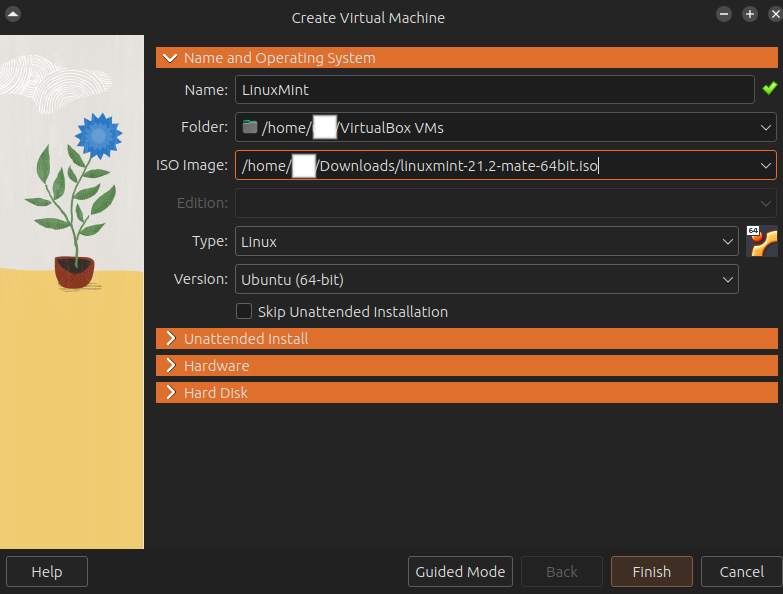
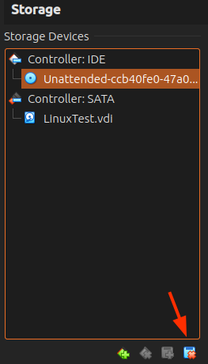

# 1. Clients

Um die Pakete in den internen Netzwerken mittels Wireshark passiv betrachten zu können setzen wir uns eine Client 
VM auf.

Dies ist nützlich, damit wir besser sehen können, was wir genau konfiguriert haben und wie die einzelnen Pakete in der
Praxis genau aussehen.


### Installation der ISO-Datei
Hierfür kann beispielsweise das Betriebssystem Linux Mint mit dem Desktopenvironment Mate verwendet werden, welches 
[hier](https://linuxmint.com/download.php) heruntergeladen werden kann (Welcher Mirror zum Herunterladen verwendet wird,
macht keinen wesentlichen Unterschied).


### Erstellen der VM
Wenn man das heruntergeladene ISO Image jetzt als virtuelle Maschine starten will, öffnet man zuerst die Ansicht in 
Virtual Box um eine neue virtuelle Maschine zu erstellen.  
Der Name für die virtuelle Maschine ist frei wählbar und hat keinen Einfluss auf den weiteren Verlauf, um möglich 
auftretende Fehler zu vermeiden, empfehlen wir in dem Namen nur Buchstaben und Zahlen zu verwenden und auf Leerzeichen
zu verzichten.  
Der Ordner für die virtuellen Maschinen sollte bei dem standard Ordner bleiben, außer Sie haben schon von
früheren Maschinen den Ordner an eine andere Stelle verlegt.

Für die ISO-Datei wählen Sie die ISO-Datei aus, welche Sie soeben heruntergeladen haben. Daraufhin, sollte sich der Typ
und die Version automatisch ändern, falls dies nicht der Fall ist, ändern Sie den `Typ` auf `Linux` und die `Version` 
auf `Ubuntu (64-Bit)`.

Final sollte die VM Konfiguration ungefähr wie folgt aussehen:

<figure markdown>
  { loading=lazy width=600px }
</figure>


### Einrichten der VM
Wenn Sie nun auf Weiter/Finish o. Ä. gedrückt haben, sollte sich die VM automatisch starten und es sollte der Linux Boot
Manager zu sehen sein. Für Linux fremde Nutzer könnte dies etwas befremdlich aussehen, aber das einzige, was Sie machen 
müssen, ist <kbd>&#x21b5;</kbd> (Enter) drücken.

Nun sollte das System hochfahren.
Oben Links in der Ecke sollte sich eine CD mit dem Schriftzug `Install Linux Mint` befinden. Dieses Icon können Sie wie
ein Programm starten. Nach einem Doppelklick und kurzer Wartezeit sollte sich ein Fenster öffnen, wo Sie zuerst die 
gewünschte Sprache auswählen können. Danach folgt das Keyboard Layout.  
Die nächsten drei Fenster können Sie einfach durchklicken, ohne Änderungen vorzunehmen.  
Die nächsten Fenster zum Setzen der Zeitzone und der Konfiguration des Benutzers sollten selbsterklärend sein.  
Im nächsten Schritt wird das System installiert. Das kann von Gerät zu Gerät eine Zeit dauern (3 - 8 Minuten).  
Wenn das System fertig installiert ist, können Sie die VM neu starten. Dabei ist aber zu beachten, dass man davor die 
Installationsdatei entfernen muss. Dies kann man machen, indem man in Virtual Box in die Einstellungen der Maschine 
geht, dann auf Speicher/Storage und dort die `Unattended-(...).iso.viso` mit dem Icon am unteren Ende des Fensters 
löscht.

<figure markdown>
  { loading=lazy width=200px }
</figure>

### Installation Wireshark
Nachdem die virtuelle Maschine neu gestartet wurde, kann Wireshark über den Paketmanager installiert werden:
```shell
sudo apt install -y wireshark
```

Damit man Wireshark auch ohne Admin komplett verwenden kann, muss man noch folgenden Befehl im Terminal ausführen:

```shell
sudo usermod -aG wireshark $USER
```

Nach einem Logout und erneutem Login ist Wireshark fertig installiert.


### Konfiguration Wireshark

Damit unser Client keine eigenen Pakete in die internen Netzwerke unserer Router sendet, deaktivieren wir die IPv4 und 
IPv6 Netzwerkkonfiguration im NetworkManager.

> TODO @Luis Bilder für Linux Mint mit Mate

Anschließend fahren wir die virtuelle Maschine herunter und konfigurieren das Netzwerkinterface auf unser internes 
Netzwerk um. Den `Promiscuous Mode` setzen wir auf `Allow All`, sodass die virtuelle Netzwerkkarte unserer virtuellen
Maschine nicht nur die Pakete empfängt, die für die eigene MAC Adresse oder alle Teilnehmer im Netz (Broadcast / 
Multicast) bestimmt sind.

> TODO @Luis Bild der VirtualBox Netzwerkkonfiguration


### Wireshark Grundlagen

> TODO @Luis Verwendung von Wireshark grob erklären, im ersten Grundlagenkapitel wird das Ganze an Ethernet gezeigt. 


### Optional: Bildschirmauflösung anpassen

Momentan sollte die VM in einem ziemlich kleinen Fenster sein und sich nicht dem Virtual Box Fenster anpassen. Um 
die optimale Anpassung zu konfigurieren braucht man 2 Schritte:

#### 1. Download Guest Additions 
Um die Guest Additions herunterzuladen, geht man oben links in der VM auf Geräte/Devices und wählt dort den letzten
Punkt aus.

> TODO @Luis Bild von Guest Addition Download Button