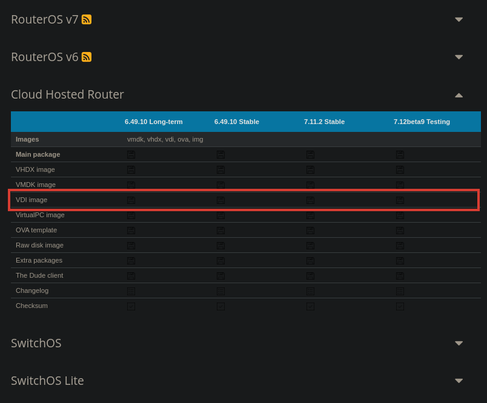

# 2. Mikrotik RouterOS

MikroTik RouterOS ist ein proprietäres Betriebssystem, welches von MikroTik entwickelt wurde und auf deren 
Netzwerkgeräten eingesetzt wird. Es bietet umfassende Routing-, Firewall- und Managementfunktionen für Netzwerke und ist
speziell auf die Hardware von MikroTik-Geräten zugeschnitten.

Zusätzlich zur hardwarebasierten Implementierung gibt es auch eine Cloud Hosted Router-Variante von MikroTik RouterOS,
welche für den Einsatz in virtuellen Umgebungen optimiert ist. Diese kann ohne Kosten mit einer maximalen Geschwindigkeit 
von 1 Mbit/s verwendet werden, was für Testzwecke ausreichend ist
([siehe Lizenzbedingung](https://wiki.mikrotik.com/wiki/Manual:CHR#CHR_Licensing)).

Für physische MikroTik-Geräte ist der Einsatz von RouterOS mit Lizenzen-Level verbunden([siehe Lizenzbedingung](https://wiki.mikrotik.com/wiki/Manual:License#License_Levels)).
Die meisten Geräte (RouterBoards, Cloud Core Router und Cloud Router Switche) werden standardmäßig mit einer Level 5 
Lizenz ausgestattet, welche für nahezu alle Anwendungsfälle ausreichend ist.

## Einrichtung der virtuellen Maschine
Laden Sie zunächst von der [Mikrotik Download Seite](https://mikrotik.com/download) die gewünschte Version von RouterOS als VDI 
(unter der Kategorie Cloud Hosted Router) herunter und entpacken Sie die vdi-Datei aus dem zip-Archiv. 



Anschließend wird eine neue virtuelle Maschine ohne virtuelle Festplatte erstellt (128 MB RAM, 1 Kern sind ausreichend).
Es ist empfehlenswert die heruntergeladene vdi-Datei ins Verzeichnis der virtuellen Maschine zu verschieben, sodass alle
notwendigen Dateien in einem Ordner liegen. Dann kann über die Einstellungen die heruntergeladene virtuelle Festplatte
hinzugefügt werden (Storage -> SATA Controller -> +), sowie die serielle Konsole und die Netzwerkkonfiguration angepasst 
werden. 

> TODO @Luis VirtualBox Bilder (Festplatte hinzufügen, Netzwerkkonfiguration, Seriellen Port) hinzufügen

Nach dem Start der virtuellen Maschine ist ein Login mit `admin` und leerem Passwort möglich, woraufhin das Passwort 
direkt geändert werden muss.

=== "Linux"
    Um sich mit dem UNIX Socket, welcher die serielle Schnittstelle zur virtuellen Maschine darstellt, zu verbinden kann
    die Software socat wie folgt verwendet werden:

    ```sh
    socat UNIX-CONNECT:/tmp/routeros -,b9600,echo=0,raw
    ```

=== "Windows"
    > TODO @Luis Beschreibung für Verwendung von Putty oder ähnlichem einfügen
