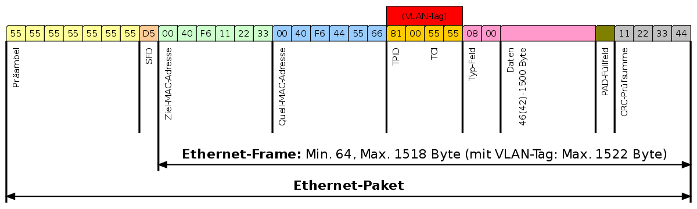

# 2. Virtual LAN (IEEE 802.1q)

!!! info
    Ein Virtual Local Area Network ist ein logisches Netzwerk, das in einem physischen Netzwerk erstellt wird, um 
    Gruppen von Geräten zu isolieren und zu organisieren. VLANs ermöglichen es, den Datenverkehr in einem Netzwerk zu 
    segmentieren und zu steuern, indem sie Geräte in unterschiedliche virtuelle Gruppen aufteilen, unabhängig von ihrer
    physischen Position im Netzwerk.

<figure markdown>
  { loading=lazy width="500px" }
</figure>

=== "VyOS"
    ```sh
    set interfaces ethernet eth0 vif 15 address '10.0.0.1/30'
    ```

=== "Mikrotik RouterOS"
    ```sh
    interface/vlan/add interface=ether1 vlan-id=15 name=ether1.15
    ip/address/add address=10.0.0.2/30 interface=ether1.15
    ```



> TODO: ping -> In Wireshark ARP und ICMP betrachten und bilder machen (unterschied zu ethernet (vlan tag) aufzeigen)